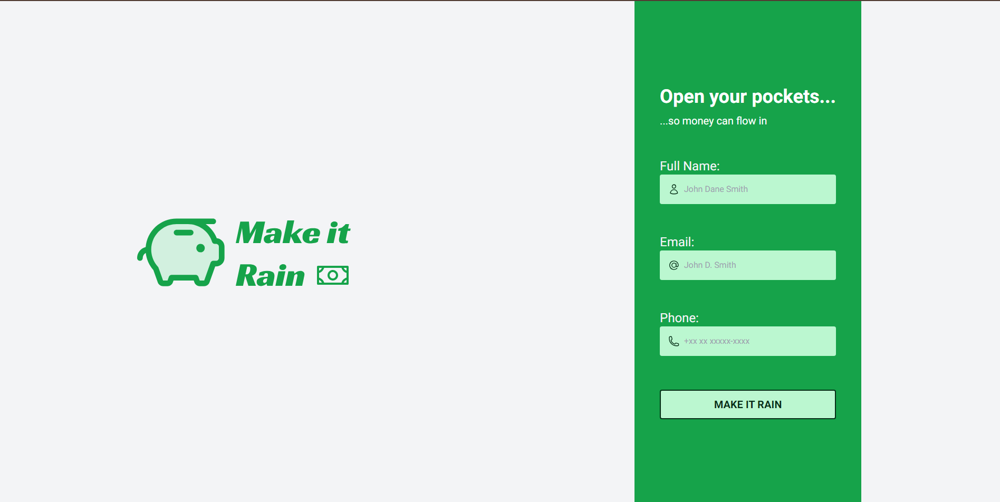

<h1 align="center"> Make it Rain! </h1>

<p align="center">
Make it Rain! is a non-interactive landing page project developed to practice TailwindCSS. <br/>
</p>

<p align="center">
  <a href="#-technologies">Technologies</a>&nbsp;&nbsp;&nbsp;|&nbsp;&nbsp;&nbsp;
  <a href="#-deploy">Deploy</a>&nbsp;&nbsp;&nbsp;|&nbsp;&nbsp;&nbsp;
  <a href="#-portugese-version">Portuguese Version</a>&nbsp;&nbsp;&nbsp;&nbsp;&nbsp;&nbsp;
</p>

<p align="center">
  
</p>

## 🚀 Technologies

This project was developed using:

- TailwindCSS
- TypeScript
- NextJS
- Hero Icons
- PostCSS
- ESLint
- Figma

## 💻 Deploy

> [Click here to view the project!](https://tailwind-practice-pied.vercel.app/)


<!-- ## 💻 Rode Local
---
Para rodar o projeto localmente, basta cumprir as seguintes etapas:

1. Git clone
2. Git install
3. Npm start -->

## 🌎 Versão em Português

Make it Rain! é uma landing page não-interativa desenvolvida com o objetivo de praticar TailwindCSS. Para desenvolver essa aplicação eu usei:
- TailwindCSS, TypeScript, NextJS, Hero Icons, PostCSS, ESLint e Figma

Para ver a aplicação rodando é só [clicar aqui](https://tailwind-practice-pied.vercel.app/) !
<!-- or run locally following these steps:
```
ETAPAS PARA RODAR LOCAL EM PROJETOS MAIS COMPLEXOS
```  -->

---
### Developed by Sarah Schneider 🖖